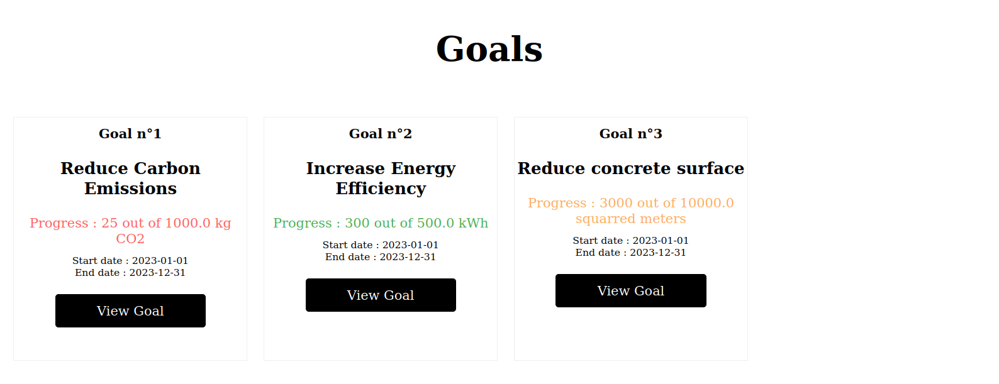
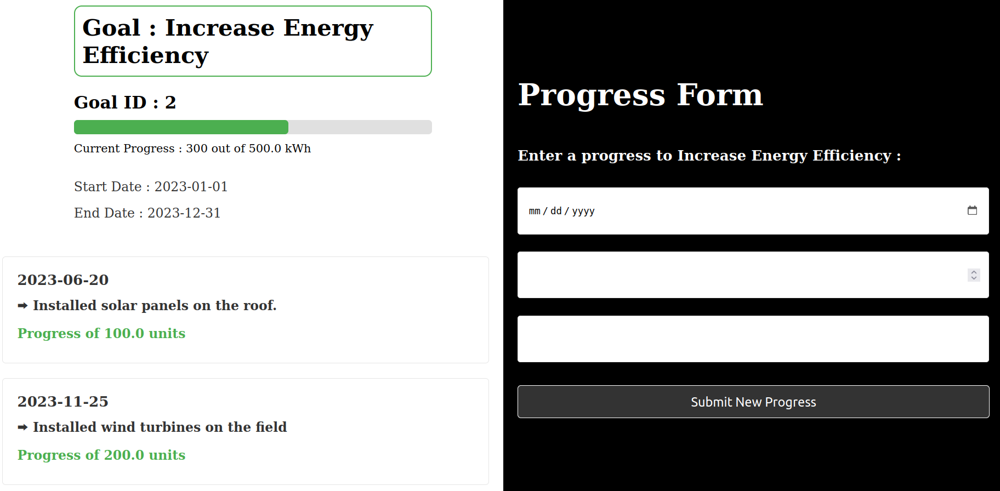

# Sustainability Goal Planner

This project is a sustainability goal planner application built using Ruby on Rails with React webpacker setup. The application allows to follow goal progresses over time.

It could actually be used for any kind of goal planning but there is a special focus of goals with a specific unit of measurement (e.g. kg EqCo2, m², etc.) and a target value to reach.

## Preview

    

        
        
    

## Features

- Create, Read, Update, Delete goals
- Create, Delete progresses of the goals
- View all goals and progresses

See [OPEN API DOCUMENTATION HERE](./openapi.yml)

## Quick start

### Prerequisites

- Ruby 2.7.6
- Rails 6.1.7.6 with webpacker React
- PostgreSQL
- Axios
- Styled Components

### Installation and launch

1. Install dependencies: `bundle install` and `yarn install`
2. Set up the database: `rails db:create` && `rails db:migrate` && `rails db:seed`
3. Start the server: `rails s`

The app is running on [localhost:3000](http://localhost:3000/)

## Credits 

I get inspired and followed ["Zayne" youtube tutorials](https://www.youtube.com/watch?v=oyjzi837wME) 
